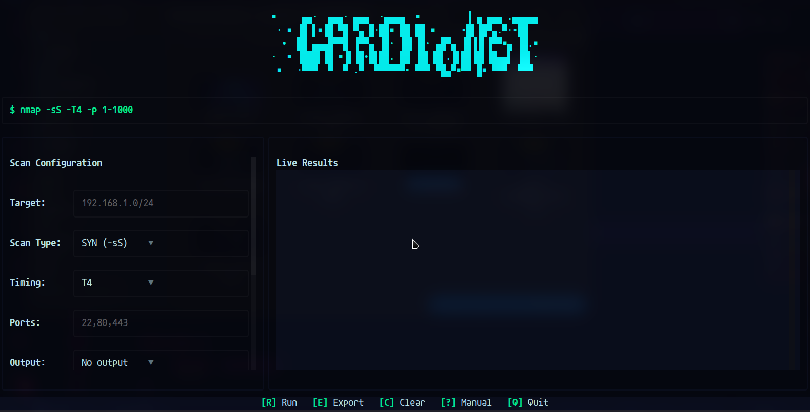
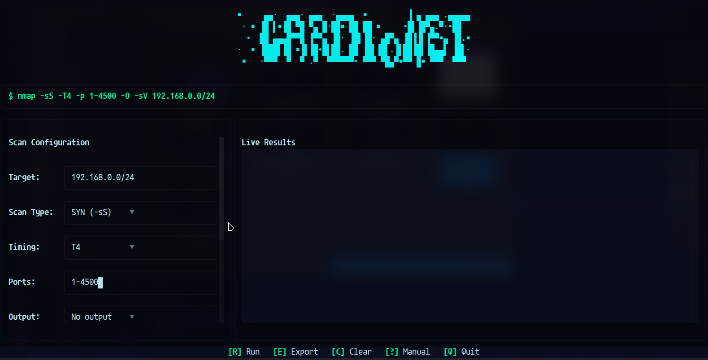
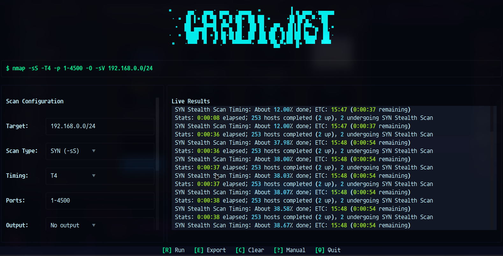
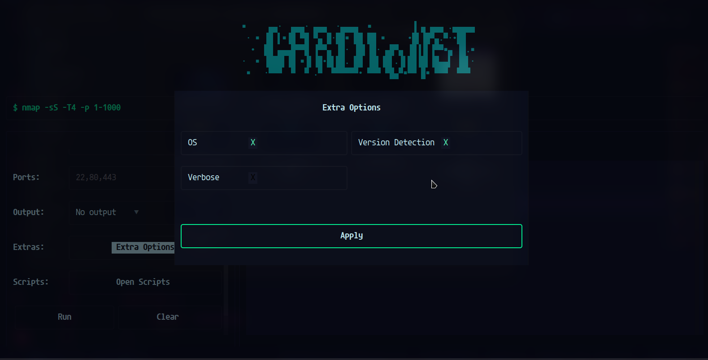
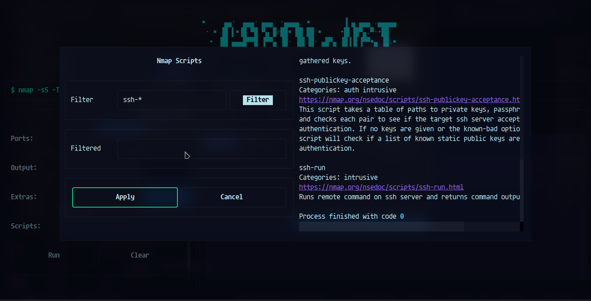
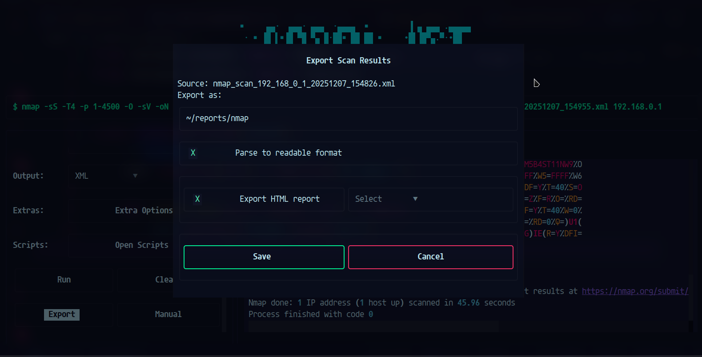
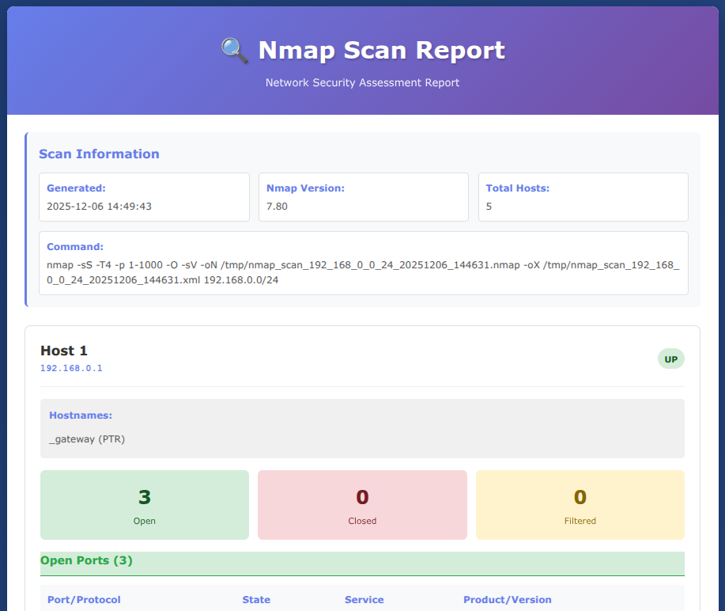
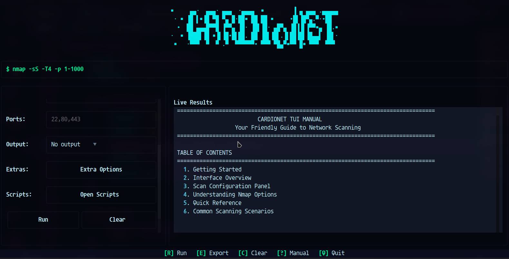

# CardioNet - Nmap TUI


A beautiful, modern Terminal User Interface (TUI) for nmap, built with Python and Textual.

CardioNet simplifies network scanning by providing an intuitive graphical interface for nmap, making it accessible to both beginners and advanced users. Build complex scanning commands visually, execute them in real-time, and export results in multiple formats with professional HTML reports.

## ✨ What's New

### 🎨 HTML Export with Customizable Templates (NEW)

CardioNet now features a powerful **HTML export system** that transforms your scan results into professional, stakeholder-ready reports:

- **Customizable Templates**: Create your own HTML templates and save them to the `templates/` folder. CardioNet automatically detects and lists them during export
- **Professional Reports**: Generate beautifully formatted HTML reports with:
  - Executive Summary
  - Network Topology Overview
  - Host Discovery Results
  - Port and Service Analysis
  - OS Fingerprinting Data
  - ...
- **Template Selection**: During export, choose from built-in templates or your custom templates
- **Branding Support**: Customize reports with company logos, colors, and branding

This feature is perfect for sharing findings with management, clients, and stakeholders who need clear, visual presentations of security assessments.

---

## Features

### 🎯 Intuitive Scan Configuration

- **Multiple Scan Types**: SYN, TCP, UDP, FIN, ACK, Xmas, and Host Discovery
- **Timing Templates**: T0-T5 for customized scan intensity
- **Port Specification**: Single ports, ranges, or common port lists
- **Target Support**: Individual IPs, CIDR notation, or domain names

### 🔧 Advanced Options

- **OS Detection** (-O): Identify operating systems
- **Version Detection** (-sV): Detect service versions
- **Verbose Mode** (-vv): Detailed scan output
- **NSE Scripts**: Browse and apply nmap's script library with filtering

### 📤 Export & Reporting

- **Multiple Output Formats**: Normal, XML, Grepable, and **HTML** (NEW)
- **Smart XML Parsing**: Convert XML to beautifully formatted text reports
- **HTML Export**: Generate professional reports with customizable templates
- **Template System**: Create and manage custom HTML templates in the `templates/` folder
- **Automatic Timestamps**: Files saved with date/time stamps in `/tmp`
- **Real-time Streaming**: Watch scan results appear live

### 🎨 User Experience

- **Live Command Preview**: See the exact nmap command being executed
- **Built-in Manual**: Comprehensive guide accessible within the app
- **Neon Theme**: Modern, easy-on-the-eyes interface
- **Keyboard Shortcuts**: Quick access to all major functions

## Installation

### Prerequisites

- Python 3.10+
- nmap installed and available in PATH
- Linux/Unix-based system (macOS/Linux tested)

### Setup

1. Clone the repository:

```bash
git clone https://github.com/hosnizaaraoui/cardionet.git
cd cardionet
```

2. Install dependencies:

```bash
pip install -r requirements.txt
```

3. Make the script executable:

```bash
chmod +x cardionet.py
```


## Usage

CardioNet requires root privileges to perform full network scans:

```bash
sudo python3 cardionet.py
```

Or if you made it executable:

```bash
sudo ./cardionet.py
```

### Keyboard Shortcuts

| Shortcut | Action           |
| -------- | ---------------- |
| **R**    | Run scan         |
| **E**    | Export results   |
| **C**    | Clear results    |
| **?**    | Read manual      |
| **Q**    | Quit application |

### Quick Start

1. **Enter Target**: Input an IP address, CIDR range, or domain name

   - Example: `192.168.1.0/24` or `scanme.nmap.org`

2. **Choose Scan Type**: Select from SYN (default), TCP, UDP, FIN, ACK, Xmas, or Host Discovery

3. **Set Timing**: Pick a timing template (T4 recommended for internal networks)

4. **Specify Ports** (optional): Leave blank for top 1000 ports, or specify custom ranges

5. **Enable Advanced Options** (optional):

   - Click "Extra Options" to enable OS/Version detection or verbose mode
   - Click "Open Scripts" to add NSE scripts

6. **Watch Command Preview**: See your nmap command build in real-time

7. **Run Scan**: Press R or click "Run" to start scanning

8. **Export Results**: Press E to export in your choice of format

### Using HTML Export (New Feature)

1. **Complete a scan** using the normal process above

2. **Press E** to open the export dialog

3. **Select "HTML" as the export format**

4. **Choose a template**:
   - Select from built-in templates, OR
   - Choose a custom template from your `templates/` folder

6. **Generate Report**: CardioNet creates a professional HTML file with all scan data

7. **Share the report** with stakeholders - it's a self-contained HTML file

### Creating Custom HTML Templates

Templates are stored in the `templates/` folder. To create a custom template:

1. Create an HTML file with template placeholders for scan data
2. Save it to the `templates/` folder with a `.html` extension
3. Restart CardioNet
4. The template will appear in the HTML export dialog


## Examples

### Quick Host Discovery

Find active hosts on your network without detailed port information:

- Target: `192.168.1.0/24`
- Scan Type: Host Discovery (-sn)
- Timing: T4
- Export: HTML with Executive template

### Find Web Servers and Generate Report

Identify web services and create a professional report:

- Target: `192.168.1.0/24`
- Scan Type: SYN (-sS)
- Ports: `80,443`
- Enable: Version Detection
- Script: `http-title`
- Export: HTML with Professional template

### Deep System Analysis with Custom Report

Get comprehensive information and generate a branded report:

- Target: `192.168.1.100`
- Scan Type: SYN (-sS)
- Ports: `1-65535`
- Enable: OS Detection, Version Detection, Verbose
- Timing: T3
- Export: HTML with Custom Company template

### Stealthy Reconnaissance (Advanced)

Minimal network noise scanning with detailed reporting:

- Target: `192.168.1.0/24`
- Scan Type: FIN (-sF)
- Timing: T2 (Polite)
- Ports: `22,80,443,3306`
- Export: HTML with Stealth Assessment template

## Screenshots

### Main Interface

The heart of CardioNet - configure your scan with an intuitive left panel and watch results stream in real-time on the right.



### Scan Configuration

Easily set up all your scan parameters with helpful suggestions and real-time command preview.



### Live Results

Watch your nmap scan execute in real-time with color-coded output and detailed information.



### Extra Options Modal

Quick access to advanced scanning features like OS detection, version detection, and verbose mode.



### Scripts Modal

Browse and filter nmap's NSE script library, view descriptions, and add scripts to your scan.



### Export Dialog (Enhanced)

Export your scan results in multiple formats including the new HTML export with template selection.



### HTML Report Example

Professional, customizable HTML reports generated from your scan data - perfect for stakeholder presentations.



### Built-in Manual

Comprehensive guide with scan types, timing templates, and practical examples - all accessible within the app.



## File Output

CardioNet automatically saves all scan results with timestamps:

```
/tmp/nmap_scan_target_YYYYMMDD_HHMMSS.nmap     (Normal format - always saved)
/tmp/nmap_scan_target_YYYYMMDD_HHMMSS.xml      (Optional XML)
/tmp/nmap_scan_target_YYYYMMDD_HHMMSS.gnmap    (Optional Grepable)
```

When exporting XML with parsing enabled, you'll get a beautifully formatted text report:

```
/tmp/nmap_scan_target_YYYYMMDD_HHMMSS.txt
```

When exporting to HTML, the report is generated based on your selected template:


## Technical Details

### Architecture

- **Framework**: Textual (Python TUI framework)
- **Scanner**: nmap (system integration)
- **Parsing**: XML ElementTree for report generation
- **HTML Generation**: Jinja2 template engine for customizable reports
- **Theme**: Custom neon theme for modern aesthetics

### Command Building

CardioNet intelligently builds nmap commands based on your configuration:

```bash
nmap -sS -T4 -p 1-1000 -O -sV 192.168.1.0/24
```

You can see the exact command in the Command Preview window before execution.

### HTML Export System

CardioNet's HTML export uses a template-based system:

1. Scan data is collected and parsed
2. User selects a template from available options
3. Template engine (Jinja2) renders the HTML with scan data
4. Professional report is generated and saved

Templates can include conditional sections, custom styling, branding, and any HTML/CSS you want.

## Requirements

See `requirements.txt` for Python dependencies. Additionally:

- **nmap** must be installed and in your PATH
- **Root/sudo access** for full network scanning capabilities
- **Linux/Unix system** (tested on Ubuntu, Fedora, Debian, macOS)


## Ethical Considerations

CardioNet is a powerful security tool. **Only scan networks you own or have explicit written permission to scan.** Unauthorized network scanning may be illegal in your jurisdiction.

Always use responsibly and ethically.

## Troubleshooting

### "Permission denied" error

CardioNet requires root privileges:

```bash
sudo python3 cardionet.py
```

### "nmap: command not found"

Install nmap on your system:

```bash
# Ubuntu/Debian
sudo apt-get install nmap

# Fedora/RHEL
sudo dnf install nmap

# macOS
brew install nmap
```

### Scan hangs or freezes

Try reducing the port range or using a faster timing template (T5).

### Can't see results

Make sure the target is reachable and the firewall isn't blocking nmap.

### HTML templates not appearing in export dialog

Make sure your template files:
- Are in the `templates/` folder in the CardioNet directory
- Have a `.html` extension
- Contain valid HTML and Jinja2 syntax

## Contributing

Contributions are welcome! Please feel free to submit a Pull Request.

## License

This project is licensed under the MIT License - see the LICENSE file for details.

## Author

Built with ❤️ by [Hosni Zaaraoui]

## Acknowledgments

- Built with [Textual](https://textual.textualize.io/) by Textualize
- Powered by [nmap](https://nmap.org/) by Gordon Lyon
- Template rendering with [Jinja2](https://jinja.palletsprojects.com/)
- Inspired by the need for a better nmap user experience

## Links

- **Repository**: https://github.com/hosnizaaraoui/cardionet
- **Nmap Documentation**: https://nmap.org/book/
- **Textual Documentation**: https://textual.textualize.io/
- **Jinja2 Documentation**: https://jinja.palletsprojects.com/
- **Issue Tracker**: https://github.com/hosnizaaraoui/cardionet/issues

---

**Happy scanning! 🚀**
